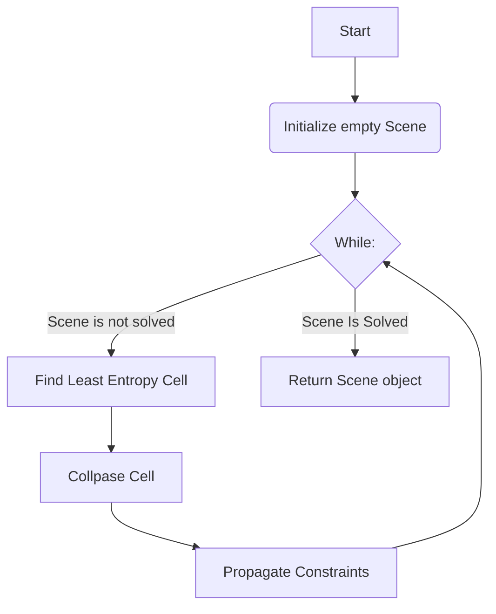
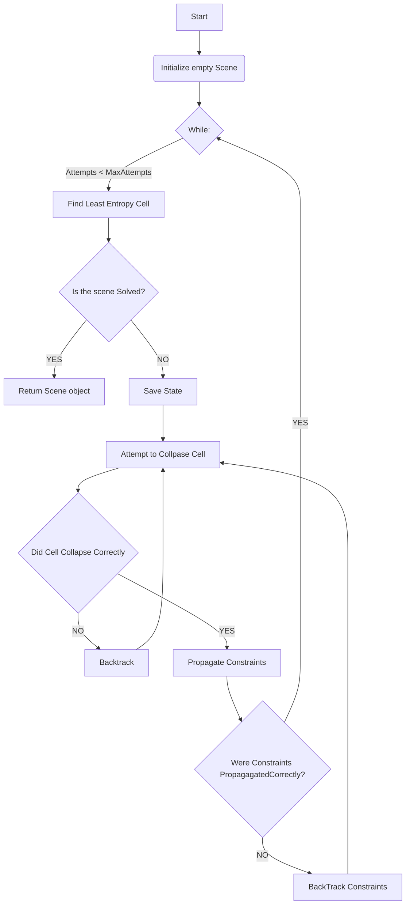

# Generación Procedural de Ambientes usando Satisfacción de Restricciones

Este proyecto implementa un sistema para generar mundos 3D proceduralmente mediante el uso de objetos 3D con técnicas de satisfacción de restricciones, inspirado en algoritmos como **Model Synthesis** y **Wave Function Collapse (WFC)**.

## Descripción

El sistema genera ambientes 3D a partir de Reglas Establecidas, las reglas defines las posibilidades de que `X` objeto tenga como vecino `Y` objeto en las seis direcciones directamente adjacentes

El enfoque se basa en:
- **Wave Function Collapse (WFC)**: Un algoritmo popularizado en videojuegos como *Bad North*, *Townscaper* y *Matrix Awakens*.
- **Model Synthesis**: Un método para generar modelos 3D mediante el ensamblado de partes predefinidas en una cuadrícula 3D.

## Antecedentes y Referencias

### Wave Function Collapse (WFC)
- [Algoritmo original (mxgmn/WaveFunctionCollapse)](https://github.com/mxgmn/WaveFunctionCollapse)
- [Implementación en C++ (fast-wfc)](https://github.com/math-fehr/fast-wfc)
- [Tesis: *Wave Function Collapse: Content Generation via Constraint Solving and Machine Learning*](https://escholarship.org/uc/item/1fb9k44q)
- [Tutorial en Procjam](https://www.procjam.com/tutorials/wfc/)
- [DeBroglie (C# Library)](https://boristhebrave.github.io/DeBroglie/)
- [Ciudad procedural infinita (marian42/wavefunctioncollapse)](https://github.com/marian42/wavefunctioncollapse)
- [Libwfc (single-header C library)](https://github.com/vplesko/libwfc)

### Model Synthesis
- [Trabajo original de Paul Merrell](http://graphics.cs.utexas.edu/papers/merrell_modelSynthesis_techReport07.pdf)
- [Tesis (2009): *Model Synthesis*](https://repositories.lib.utexas.edu/handle/2152/ETD-UT-2009-12-582)

### Artículos y Explicaciones
- [Comparing Model Synthesis and Wave Function Collapse](https://nothings.org/gamedev/model_synthesis.html)
- [The Wavefunction Collapse Algorithm explained very clearly | Robert Heaton](https://robertheaton.com/2018/12/17/wavefunction-collapse-algorithm/)

## Implementación

El proyecto incluye:
- Un generador de ambientes basado en WFC.
- Visualizacion del Escenario basado en bloques 3D.

### Diagrama Base del Algoritmo


### Con Backtracking


## Ejemplos y Demos

### Videos Relacionados
- [Procedural Generation with Wave Function Collapse and Model Synthesis | Unity Devlog](https://www.youtube.com/watch?v=0bcZb-SsnrA)
- [Coding the Overlapping Model (Wave Function Collapse)](https://www.youtube.com/watch?v=2SuvO4Gi7uY)
- [A new way to generate worlds (stitched WFC)](https://www.youtube.com/watch?v=0a_-TIWY8Hs)
- [I Made a Wave Function Collapse Castle Generator in Godot](https://www.youtube.com/watch?v=0bcZb-SsnrA)

## Notas

- Las implementaciones de WFC pueden ser computacionalmente costosas y requieren optimización para entornos grandes.
- El sistema permite la generación tanto de estructuras cerradas como de mundos infinitos mediante técnicas de "stitching".

## Licencia

Este proyecto está bajo la licencia [MIT](LICENSE).


# Compilación

## Requermimientos
Para Raylib
```
libasound2-dev libx11-dev libxrandr-dev libxi-dev libgl1-mesa-dev libglu1-mesa-dev libxcursor-dev libxinerama-dev libwayland-dev libxkbcommon-dev cmake
```

Se pueden instalar con:
`sudo apt-get update && sudo apt-get install -y libasound2-dev libx11-dev libxrandr-dev libxi-dev libgl1-mesa-dev libglu1-mesa-dev libxcursor-dev libxinerama-dev libwayland-dev libxkbcommon-dev cmake`


Usando CMake, desde la carpeta root del repo
```bash
cmake -B build
cmake --build build
```

# Uso:
```bash
./build/ProyectoWFC \<x> \<y> \<z> \<seed>
```
Ejemplo de uso:
```bash
./build/ProyectoWFC 10 10 5 123
```
Genera un escenario (Una matriz) de 10 ancho x 10 Profundidad x 10 Altura, usando la semilla `123` para las funciones "rng"

ó, para ver varios ejemplos predeterminados
```
./RunExamples.sh
```